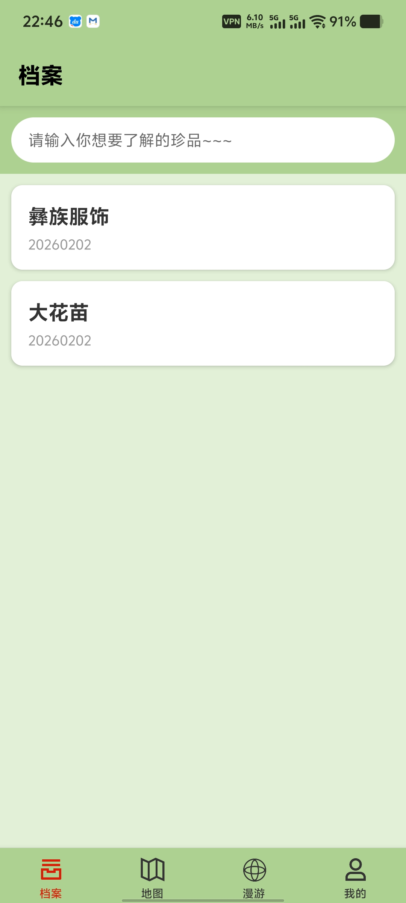
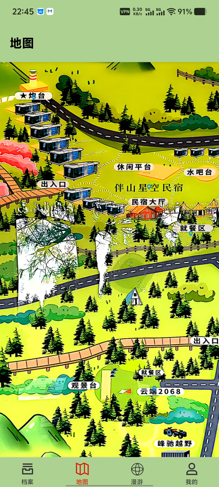
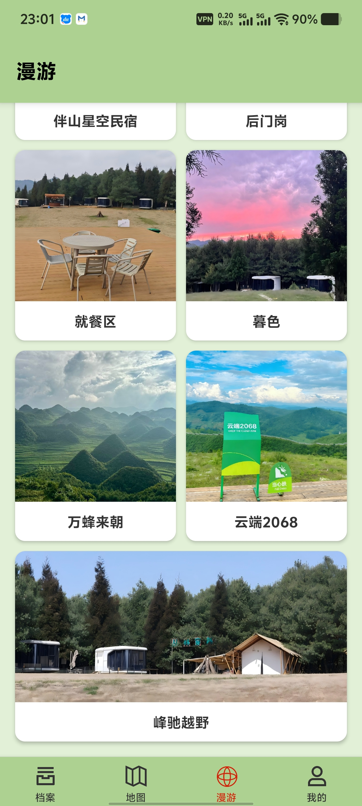
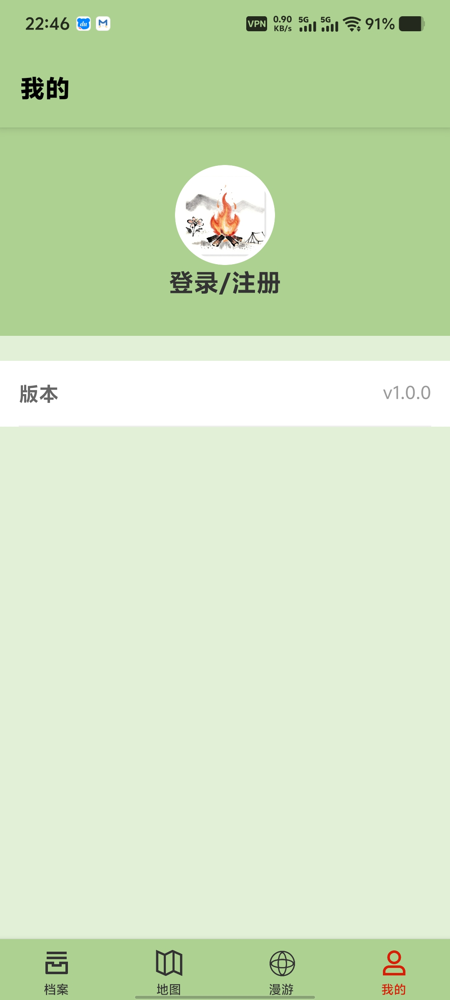

# 文旅小程序

文旅系统，包含前端Uni-app应用、React Native移动端和FastAPI后端服务。

## 项目结构

```
├── app/           # React Native 移动端应用
├── server/        # FastAPI 后端服务
├── api/           # API 接口定义
├── components/    # Uni-app 组件
├── pages/         # Uni-app 页面
├── store/         # 状态管理
├── static/        # 静态资源
├── uni_modules/   # Uni-app 模块
├── utils/         # 工具函数
└── unpackage/     # 构建输出
```

## 技术栈

- **前端**: Uni-app (Vue 3)
- **移动端**: React Native
- **后端**: FastAPI + MongoDB
  

## 效果预览






## 环境配置

### 前端 (Uni-app)

```bash
npm install
npm run dev
```

### 移动端 (React Native)

- [App 移动端](./app/README.md)

```bash
cd app
npm install
npx react-native run-android
```

### 后端

- [Server 后端](./server/README.md)

```bash
cd server
pip install -r requirements.txt
python main.py
```

